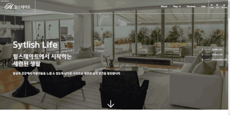

# 힐스테이트 리뉴얼

## 디자인 컨셉

기존 사이트는 건물의 외형에 집중하여 브랜드 고급스러운 이미지를 사용자에게 전달하였습니다. 하지만 다소 인위적인 분위기로 위화감을 조성할 수 있다고 판단되었습니다. 이를 개선하기 위해 실내 위주의 이미지와 감성적인 이미지를 사용하여 사용자들에게 힐스테이트만의 라이프스타일, 경험, 편안함을 전달하려 했습니다. 또한 곳곳에 1320px 그리드를 넘어 화면 전체를 사용하는 레이아웃을 사용하여 단조로움을 깨고 트렌드한 이미지를 전달하고자 하였습니다.

## Pages

- index

브랜드의 전체적인 이미지를 전달하는 페이지로 이미지 슬라이드를 통하여 힐스테이트의 컨셉인 세련된 생활, 다양한 생활, 편안한 생활을 감성적으로 전달하였고 구체적인 수치와 리뷰를 게시하여 사용자에게 정확한 정보를 전달하려 하였습니다. 단지 외관만 멋진 아파트가 아닌 실제로 거주하고 싶은 아파트를 표현하기 위해 자연스러운 풍경사진을 배치하였습니다.

- sub1 about

힐스테이트를 소개하는 페이지 입니다. 힐스테이트의 역사와 contact, 그리고 언론에서 다뤄지는 힐스테이트를 소개하는 섹션으로 나뉘어져 있습니다. 역사는 히스토리와 타임라인으로 나누어 시기별 힐스테이트의 변화와 각 년도별 건축된 아파트를 소개합니다. 스크롤이 길어지면 사용자에게 피로감을 유발할 수 있기에 탭메뉴로 다시 섹션을 분리하여 정보를 전달하고자 하였습니다. contact 섹션은 힐스테이트에 의뢰를 요청할 수 있도록 form 태그와 다양한 input 태그를 사용하여 전달 양식을 구현하였습니다. 마지막으로 언론 속의 힐스테이트는 힐스테이트를 언급한 언론을 모아둔 섹션으로 직접 링크를 걸어두진 않았지만 기획의도는 실제 해당 기사 이동할 수 있게 하는 것 입니다.

- sub2 info

힐스테이트의 정보를 담은 페이지입니다. 크게 공지사항, 자주묻는질문, 문의하기 섹션으로 나뉘어져 있습니다. 공지사항은 테이블 태그를 사용하여 게시판을 구현하였습니다. 자주묻는질문 섹션은 탭메뉴와 드롭다운 메뉴를 사용하여 정보를 정리하여 사용자가 원하는 정보를 열람할 수 있게 하였습니다. 문의하기 섹션은 form태그와 다양한 input 태그를 활용하여 문의하기 양식을 구현하였습니다.

## 구현 기능

- 고정된 헤더 : 스크롤 하면 고정되는 헤더바를 만들어 사용자가 언제든 다른 페이지로 이동할 수 있게 편의성을 높였습니다.
- 페이드 아웃 이미지 슬라이드 : 옆으로 넘어가는 형식이 아닌 이미지가 자연스럽게 페이드 아웃되는 슬라이드를 구현하였습니다. 텍스트에도 transform: traslateY 속성과 opacity 속성을 이용하여 애니메이션 효과를 주었습니다.
- 카운트 애니메이션 : banner 영역에 도달하면 숫자가 자동으로 카운트되어 올라가는 애니메이션 효과를 구현하였습니다.
- 탭메뉴, 드롭다운 메뉴 : 탭 메뉴와 드롭다운 메뉴를 활용하여 방대한 양의 정보를 정리하여 사용자가 원하는 정보를 쉽게 찾아볼 수 있게 하였습니다.

## 반응형

데스크탑을 기준으로 디자인되었으며 1320px 이상, 1320px이하 ,1024px이하, 768px 이하를 분기로 반응형을 구현하였습니다.
